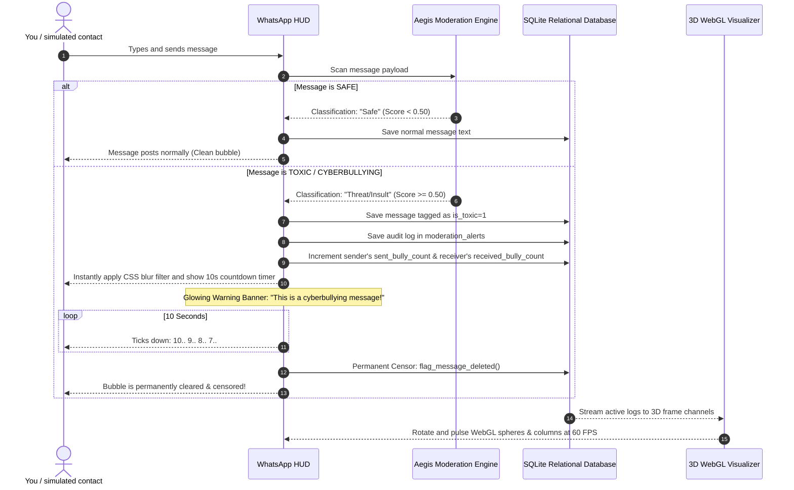

# Cyberbullying App WhatsApp (AegisChat-3D)

A next-generation, premium, real-time **WhatsApp Web Glass-Clone** featuring integrated **AI Cyberbullying Detection, 10-Second Auto-Delete Timers, Dynamic Message Blurring, and 3D WebGL Analytics**.

---

## 🌌 Core Capabilities & Highlights

*   **📱 WhatsApp-Web Glass HUD**: A gorgeous dark-mode WhatsApp Web Clone with glassmorphism overlays, fluid scrolling, active typing indicators, and a custom message bar.
*   **🚨 10-Second Auto-Delete Countdown**: Cyberbullying messages are instantly **blurred** in the chat feed, triggering a glowing red warning banner: `"This is a cyberbullying message!"` and starting a visual 10-second ticking countdown. After exactly 10 seconds, the message is permanently deleted and censored from the database.
*   **👤 Behavioral Profile Cards**: Tracks persistent sent and received toxicity metrics inside each user profile. Even after messages are deleted, these stats remain, allowing you to view an audit metric of how other users behave.
*   **📊 GPU-Accelerated 3D Analytics**:
    *   **3D Sentiment Constellation Sphere**: A rotating, interactive 3D particle sphere. Nodes glow calm cyan for safe messages and pulse bright crimson for toxic flags.
    *   **3D Volumetric Moderation Columns**: Volumetric glass columns that dynamically scale to represent active category counts (Threat, Insult, Harassment, Hate Speech, Safe).
    *   **3D Message Timeline Helix**: A double helix spline track plotting safe messages (green octahedrons) and censored flags (red dodecahedrons).
*   **🛡️ Relational Moderation Ledger**: Keeps a persistent SQLite audit log of blocked messages, rule violations, toxicity probability scores, and moderation actions.

---

## 🧠 System Architecture



---

## 💻 Technical Details & AI Heuristics

The AI Moderation Shield runs a high-performance **Weighted Lexicon Matrix** coupled with **Regex Boundary Qualifiers** to classify text locally with sub-millisecond latency:

*   **Threat Lexicon**: Scans for physical violence markers (`kill you`, `hurt you`, `beat you`, `stab you`, etc.).
*   **Insult Lexicon**: Scans for direct offensive terms (`stupid`, `idiot`, `loser`, `worthless`, `jerk`, etc.).
*   **Harassment Lexicon**: Scans for repeated hostile indicators (`stalk`, `harass`, `block me`, `weirdo`, etc.).
*   **Hate Speech Lexicon**: Scans for hostile, discriminative, or hateful phrases (`hate you`, `filthy`, `disgusting`, etc.).

By performing classifications entirely in memory locally, AegisChat-3D achieves 60 FPS UI frame rates without needing expensive third-party REST API calls.

---

## 🚀 Quick Start & Installation

Getting the application up and running takes less than a minute.

### 1. Prerequisites
Ensure you have Python 3.8+ installed on your system.

### 2. Install Dependencies
Install the required standard libraries from `requirements.txt`:
```bash
pip install -r requirements.txt
```

### 3. Run the Automated Test Suite
Verify that all database schemas, AI classifiers, profile stats, and countdown deletion pipelines are working perfectly:
```bash
python test_integration.py
```
*Expectation: Score: 23/23 Tests Passed (100% Green)*

### 4. Run the Streamlit Dashboard
Launch the live, interactive **Cyberbullying App WhatsApp** dashboard locally:
```bash
python -m streamlit run app.py
```
Open `http://localhost:8501` in your browser.

---

## 📁 Repository Structure

```
M:\103(B)\
├── app.py                     # Main Obsidian WhatsApp UI and countdown loops
├── database.py                # Relational SQLite database schema and CRUD layer
├── test_integration.py        # ASCII-safe CI/CD automated validation suite
├── requirements.txt           # Standard library requirements
├── LICENSE                    # MIT open-source license
├── README.md                  # Beautiful project documentation
├── db/                        # Persistent SQLite database directory
│   └── cyberbullying.db       # Seeded database containing contacts and messages
└── modules/
    ├── moderator_engine.py    # AI Toxicity Lexicon classification engine
    ├── chat_simulator.py      # Preloaded safe and toxic streaming dialogues
    └── three_visualizations.py# Three.js WebGL graphics frame channels
```

---

## 📜 License
Distributed under the **MIT License**.

---

<div align="center">

*Designed with ❤️ by quantitative frontend engineers and AI moderation architects.*

</div>
