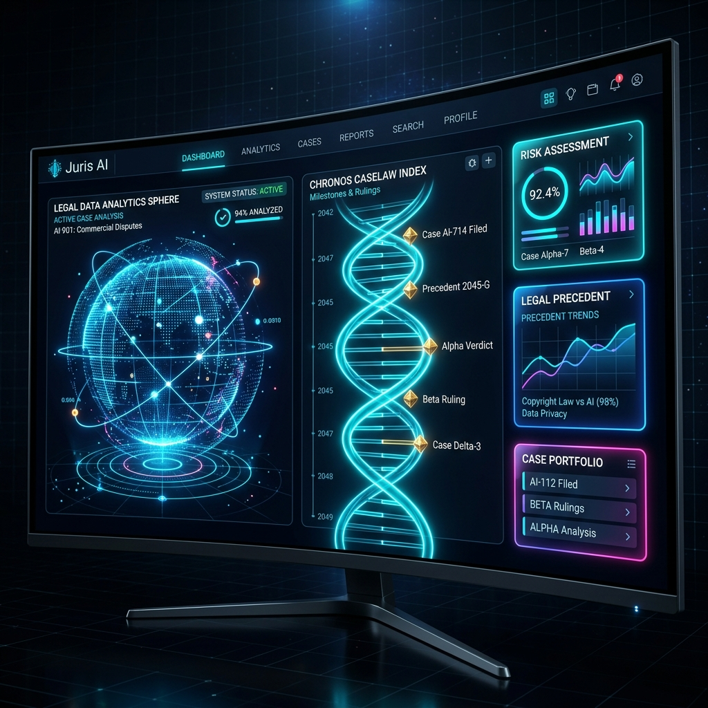
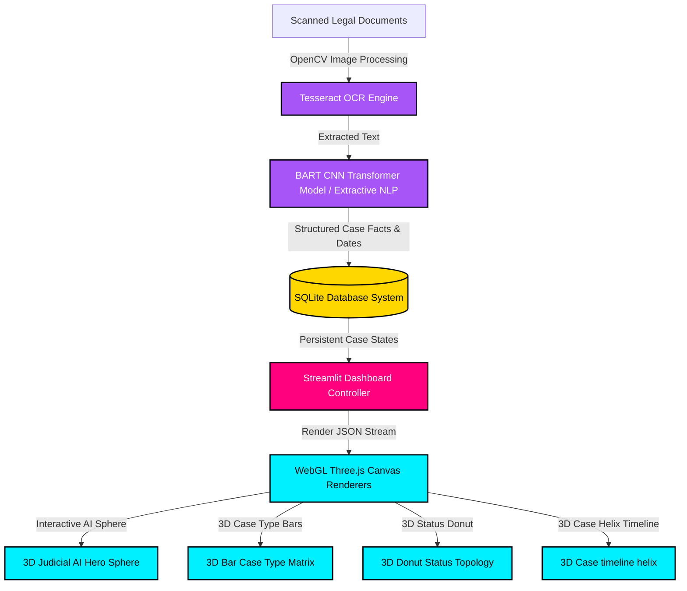

# ⚖️ Smart Judicial Case Timeline Analyzer (Judicial OS v3.5)

[](LICENSE)
[](https://threejs.org/)
[](https://streamlit.io/)
[](https://www.sqlite.org/)

A modern, professional AI-powered dashboard built for legal teams and court case timeline analysis. Featuring beautiful, interactive **3D WebGL visualizations** built with Three.js, a clean glassmorphism theme, and a sleek dark layout.



---

## 🌌 Core System Architecture



---

## ✨ Interactive 3D & Advanced Features

### 💻 3D Three.js Visualizations
* **3D AI Sphere Core**: An interactive 3D particle sphere representing the judicial network. You can rotate and interact with it using your mouse.
* **3D Donut & Bar Charts**: Semi-transparent 3D bars and donut charts that show case data. Hovering over a chart element displays a detailed tooltip with exact case counts.
* **3D Case Timeline Helix**: Shows case history along an interactive 3D helical track. Hovering over timeline events opens a clean card with dates and summaries.
* **Interactive Lighting**: Subtle lighting effects in gold, cyan, and magenta that react to your mouse cursor.

### 📄 Smart OCR Document Processing
* **Auto Pre-processing**: Uses OpenCV to automatically deskew, de-noise, and enhance scanned document images before running OCR for better text extraction.
* **Visual Scanner Loader**: A glowing scanner line sweeps down your document when the OCR process runs.
* **Direct Database Link**: Extracted text is fully editable and links directly to your case record in the SQLite database.

### 🧠 Advanced NLP Judgment Summarizer
* **Smart BART Summarization**: Uses Facebook's BART CNN model for high-quality, abstractive summaries of complex legal judgments.
* **Extractive Summary Fallback**: Features a fast, localized sentence-scoring engine that identifies key points using custom legal keywords.
* **Entity Extractor**: Automatically pulls dates, statutes, judges, parties, and legal terms (like *bail*, *writ*, etc.) into interactive chips.

### 🛡️ Premium UI/UX Style Guide
* **Glassmorphism Panels**: Uses frosted transparent backdrops (`backdrop-filter`) with thin glowing cyan borders and smooth hover motions.
* **Clean Typography**: Uses the modern sans-serif fonts 'Space Grotesk' for headers and 'Plus Jakarta Sans' for easy-to-read lists and data.
* **Futuristic Badging**: Color-coded badges and status markers for instant case updates (Urgent, High, Normal).

---

## 🛠️ Quickstart Installation & Deployment

### Prerequisite Dependencies
Ensure you have **Python 3.8+** installed on your system. 

For the **OCR Image Extraction** feature, [Install Tesseract OCR](https://github.com/UB-Mannheim/tesseract/wiki) and ensure it is added to your system's PATH.

### 1. Clone & Initialize Environment
```powershell
# Clone the repository
git clone https://github.com/your-username/judicial-timeline-analyzer.git
cd judicial-timeline-analyzer

# Initialize Virtual Environment
python -m venv .venv
.venv\Scripts\activate
```

### 2. Install Required Python Packages
```powershell
pip install -r requirements.txt
```

### 3. Preload Sample Datasets
Generate and load realistic sample datasets containing 50+ basic litigation cases, 30+ patent profiles, and realistic legal judgment texts.
```powershell
# Generate realistic raw CSV data
python generate_data.py

# Wipe and populate the SQLite Database
python load_data.py
```

### 4. Deploy the Dashboard
Deploy the interactive 3D WebGL dashboard server locally.
```powershell
streamlit run app.py
```
Open your browser and navigate to `http://localhost:8501`.

---

## 📁 Repository Structure

```
├── .streamlit/
│   └── config.toml          # Dark theme layout configurations
├── assets/
│   └── banner.png           # 3D generated landing showcase image
├── db/
│   └── judicial.db          # Active populated SQLite database
├── data/                    # Generated mock litigation & patent CSV files
├── modules/
│   ├── case_flow.py          # Timeline mapping algorithms
│   ├── nlp_summarizer.py     # NLTK extractive & Transformers summarizer
│   ├── ocr_extractor.py      # OpenCV pre-processors & Tesseract OCR wrapper
│   └── three_visualizations.py # Custom Three.js WebGL component templates
├── app.py                   # Upgraded dashboard UI and styling engine
├── requirements.txt         # Package dependencies
├── LICENSE                  # Open-source MIT License
└── README.md                # System documentation
```

---

## 📜 MIT License
This project is open-source and distributed under the terms of the [MIT License](LICENSE). 
Created and maintained with ❤️ by world-class UI/UX engineers and Three.js visualization architects.
