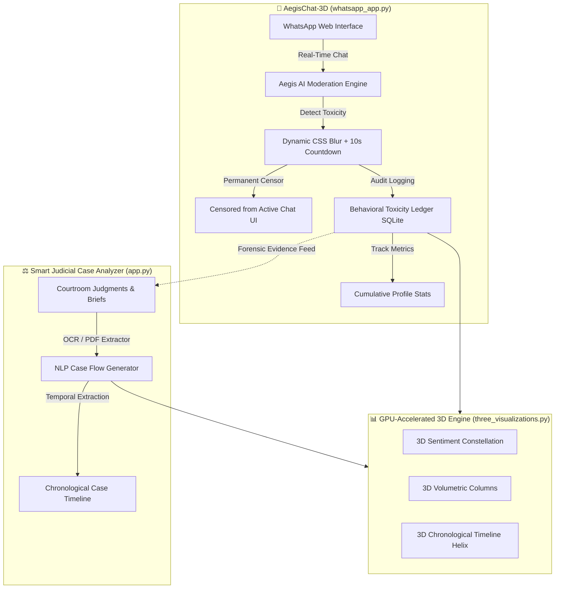

# 🧬 LexHelix: Dual-Engine Legal Analytics & Digital Safety Ecosystem

Welcome to **LexHelix**, a premium, high-fidelity dark-mode platform designed to revolutionize legal document analysis and digital communication safety. LexHelix houses two powerful real-time web applications under a unified neon-cyber aesthetic:

1. **⚖️ Smart Judicial Case Timeline Analyzer (`app.py`)**  
   *Interactive NLP litigation visualizer, multi-format OCR engine, and judicial intelligence room.*  
   👉 **Live Deployment:** [lexhelix.streamlit.app](https://lexhelix.streamlit.app/)

2. **💬 AegisChat-3D: Cyberbullying App WhatsApp (`whatsapp_app.py`)**  
   *Real-time WhatsApp Web clone simulator featuring automated 10s countdown censors, dynamic CSS blurring, and live behavioral audit profiles.*  
   👉 **Live Deployment:** [lexhelix-whatsapp.streamlit.app](https://lexhelix-whatsapp.streamlit.app/)

---

## ⚡ The Architectural Relationship: The Digital Forensics Pipeline

While these two engines serve different front-line scenarios, they are deeply integrated beneath the surface:



1. **Evidence & Digital Forensics Bridge**: 
   The **AegisChat-3D** system logs every flagged cyber-violation, toxic threat, and severity level into a persistent SQLite database (`cyberbullying.db`). This ledger serves as critical **digital forensics evidence**. This structured evidence feed can be directly imported and processed by the **Smart Judicial Case Timeline Analyzer** to reconstruct temporal sequence charts for harassment litigation, hate speech lawsuits, or custody cases.
2. **Unified 3D Rendering Architecture (`three_visualizations.py`)**: 
   Both applications share a state-of-the-art WebGL/Three.js render pipe. Whether plotting complex legal case stages or tracing live communication toxicity paths, both systems feed data into identical GPU-accelerated graphic modules to display stunning 3D Constellations, Volumetric Column charts, and Chronological Helix tracks.

---

## ⚖️ Engine 1: Smart Judicial Case Timeline Analyzer (`app.py`)

A comprehensive litigation-support app designed to help legal teams, judges, and researchers rapidly parse mountains of judicial pages.

### 🌟 Core Capabilities
* **📁 Multi-Format Document OCR Room**: Drag-and-drop courtroom briefs, PDFs, or scanned images. The engine extracts high-accuracy plain text with options for Tesseract-assisted OCR processing.
* **🧠 NLP Judgment Summarizer**: Summarizes judgments and extracts crucial key points instantly using multiple selectable mathematical/NLP techniques.
* **⌛ Interactive Stage Timeline Tracker**: Translates raw case logs into a highly aesthetic, color-coded chronological interactive horizontal timeline covering filing, hearings, trials, and final disposition stages.
* **📊 GPU-Accelerated 3D Case Analytics**: Volumetric WebGL bar charts and pie charts tracking pending workloads, average disposition cycles, and legal category distributions.

### ⚙️ Working Procedure
1. **Upload Briefs**: Navigate to the **OCR Extractor** or **NLP Summarizer** tab and drop a judicial PDF or scan.
2. **Extract & Summarize**: Click *Extract Text* or *Generate Summary*. The local AI extracts relevant legal paragraphs and flags critical sections.
3. **Parse Timeline**: The **Timeline Analyzer** uses sentence-boundary heuristics to map occurrences of dates and legal actions into a temporal sequence.
4. **Interactive Audit**: Edit event logs, mark case status (Pending, Hearing, Disposed), and view 3D workload models on the visual dashboard.

---

## 💬 Engine 2: AegisChat-3D: Cyberbullying App WhatsApp (`whatsapp_app.py`)

A simulated live digital workspace demonstrating active real-time moderation, automatic threat containment, and interactive audits.

### 🌟 Core Capabilities
* **📱 WhatsApp Web Glass-HUD**: A fully interactive glassmorphism WhatsApp Web layout with functional active contact sidebars, custom profile details, and fluid dark-mode transitions.
* **🚨 10-Second Auto-Delete & Censor Countdown**: If a toxic or harmful message is typed (or injected via simulation), the system instantly triggers:
  1. A browser popup alert warning the user: `"This is a cyber message"`.
  2. A glowing neon alert banner displaying a countdown timer.
  3. Dynamic **CSS blur filters** obscuring the bubble.
  4. Automatic, permanent deletion and database sanitization when the 10-second timer hits zero.
* **👤 Permanent Behavioral Profile Cards**: Toxicity rates (Sent Warnings, Received Warnings) are logged inside persistent profile stats. Even if the chat bubble is deleted, the statistical record remains to audit personal behavior.
* **🛡️ Relational AI Shield Logs**: A secure moderation database ledger detailing the precise rule triggered (Threat, Insult, hate speech), classification probability, severity, and action taken.

### ⚙️ Working Procedure
1. **Interactive Chat**: Select any contact (e.g., Aarav, Rohan, Priya) from the sidebar. Send a message or press **⚡ Inject Next Chat Stream** to tick the simulated conversation forward.
2. **Automatic Aegis Trigger**: If a bullying word is sent, the message is instantly blurred using CSS blur-filters (`filter: blur(7px)`). An alert banner flashes indicating permanent deletion is scheduled.
3. **10-Second Deletion Tick**: The thread automatically counts down from 10 seconds. After 10s, a browser alert pops up confirming absolute censorship, and the message is replaced with a clean `🚫 [Message deleted - flagged as cyberbullying]` card.
4. **Stats Audit**: Click **👤 View Profile Stats** on the active chat header to view the user's permanent cumulative toxicity ledger and WebGL splines.

---

## 💻 Tech Stack & AI Classifiers

LexHelix relies on local, high-speed, sub-millisecond libraries:
* **UI Framework**: Streamlit (with custom injected Markdown/CSS layers).
* **Database**: SQLite3 with dedicated relational tables for messages, contacts, and moderation alerts.
* **3D WebGL Pipeline**: Embedded HTML-Three.js engines utilizing dynamic SVG rendering for absolute responsive container alignment.
* **AI Toxicity Engine**: High-performance **Weighted Lexicon Matrix** coupled with **Regex Boundary Qualifiers** classifying toxic markers (Threat, Insult, Harassment, Hate Speech) completely in-memory.

---

## 📁 Repository Structure

```
M:\103(B)\
├── app.py                      # Smart Judicial Case Analyzer Engine
├── whatsapp_app.py              # AegisChat-3D WhatsApp Simulator Engine
├── Cyberbullying app WhatsApp.py# Identical backup WhatsApp engine file
├── database.py                 # Core relational SQLite database schema
├── test_integration.py         # Full automated CI/CD validation script
├── requirements.txt            # Python dependencies (Streamlit, Plotly, Pandas, etc.)
├── LICENSE                     # MIT License
├── README.md                   # Beautiful, detailed markdown platform manual
├── db/                         # Persistent SQLite databases
│   └── cyberbullying.db        # Seeded database containing contacts, timeline logs, & metrics
└── modules/
    ├── moderator_engine.py     # Local Weighted Lexicon AI Toxicity engine
    ├── chat_simulator.py       # Simulated conversation dialogue feeds
    ├── case_flow.py            # Case stage parsers and timeline logic
    ├── nlp_summarizer.py       # NLP summarizing algorithms
    ├── ocr_extractor.py        # PDF/Image text extractor OCR wrappers
    └── three_visualizations.py # GPU WebGL 3D Constellations & spline tracks
```

---

## 🚀 Quick Local Launch

Get the complete LexHelix platform running locally in under a minute:

1. **Install Dependencies**:
   ```bash
   pip install -r requirements.txt
   ```

2. **Run Automated Integrity Validation**:
   Validate SQLite integrations, NLP classifiers, and deletion triggers:
   ```bash
   python test_integration.py
   ```

3. **Launch the Smart Judicial Analyzer (Port 8501)**:
   ```bash
   python -m streamlit run app.py
   ```

4. **Launch the AegisChat-3D WhatsApp Shield (Port 8502)**:
   ```bash
   python -m streamlit run whatsapp_app.py --server.port 8502
   ```

---

<div align="center">
Designed and developed for state-of-the-art interactive digital safety & smart legal operations. 🧬⚖️💬
</div>
